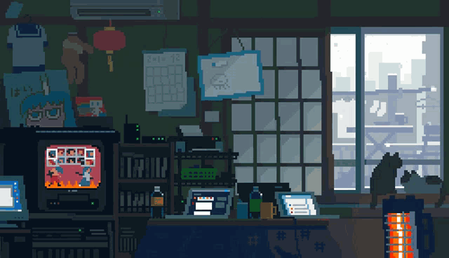

# 
 João Coutinho 

 

  

  

 

 
 ### Main skills:
&nbsp;
&nbsp;
&nbsp;

### Studying in this moment:
&nbsp;
&nbsp;
&nbsp;

<picture align="center">
  <source media="(prefers-color-scheme: dark)" srcset="https://raw.githubusercontent.com/jscoutinho/jscoutinho/output/github-contribution-grid-snake-dark.svg">
  <source media="(prefers-color-scheme: light)" srcset="https://raw.githubusercontent.com/jscoutinho/jscoutinho/output/github-contribution-grid-snake-dark.svg">
  
</picture>

