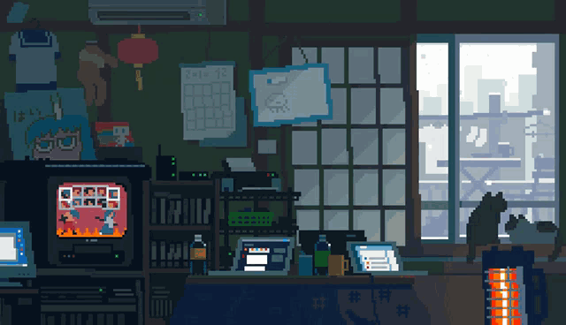

# 
 João Coutinho 

 

  

  

 ### + About Me
   Computer Science student at UERJ  
  Interested in Game Art, Music & Development 

 

 
  ### + Main Skills

 Java 
 Python
 C  
 C++ 
 JavaScript 
 HTML  
 CSS
### ◇ Currently Studying
 GdScript
 Aseprite

### # Main Projects

<a href="https://github.com/jscoutinho/lucyd-dreams">**Lucyd Dreams** </a>

Game Development project built with Godot.

<picture align="center">
  <source media="(prefers-color-scheme: dark)" srcset="https://raw.githubusercontent.com/jscoutinho/jscoutinho/output/github-contribution-grid-snake-dark.svg">
  <source media="(prefers-color-scheme: light)" srcset="https://raw.githubusercontent.com/jscoutinho/jscoutinho/output/github-contribution-grid-snake-dark.svg">
  
</picture>

